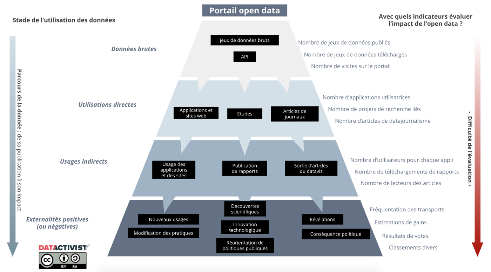

[*Article original posté sur Medium en avril 2019*](https://medium.com/datactivist/des-analytics-%C3%A0-limpact-pourquoi-%C3%A9valuer-une-politique-open-data-461504a34eca)

Quand on ouvre un portail open data, ce n’est pas juste pour que des gens téléchargent des données. Alors pourquoi, quand il s’agit d’évaluer l’efficacité d’une démarche open data, on se contente parfois de regarder seulement le nombre de téléchargements, ou le nombre de visites du portail ?

C’est une première étape, mais ce n’est pas suffisant.

Par exemple, l’impact d’un portail open data n’est pas le même s’il alimente quinze applications, sympathiques et locales, mais elles-mêmes utilisées par seulement 600 utilisateurs actifs au total ; ou s’il alimente une seule appli, mais qui elle, concentre 40% des détenteurs de smartphones (sur le territoire et dans le monde).

<blockquote>Si l’objectif d’un portail open data est d’être consulté, c’est encore mieux quand les données sont vraiment utilisées.</blockquote>

Comme l’explique le schéma ci-dessus, la valeur de la donnée se trouve dans l’usage, et ses externalités. Plus on avance dans le cycle de son utilisation, plus son impact potentiel augmente.

Mais alors, comment connaître précisément cet impact de l’utilisation des données ?

C’est là que ça se complique. **Car plus on avance dans le degrés d’utilisation des données, plus il est complexe d’évaluer leur usage et leur impact.** Le schéma ci-dessous présente cette problématique, en imaginant trois types d’utilisation de données ouvertes (applications et sites web ; études et recherches ; data journalisme, information des citoyens).

Ainsi, pour évaluer au mieux les usages de données, une des solutions peut-être de contacter les utilisateurs (les personnes qui développent les applications, les journalistes qui utilisent le portail…), et leur demander des chiffres d’utilisation / d’audience. Cela n’est pas facile, notamment parce qu’un des principes de l’open data est de donner accès aux données sans qu’une inscription soit nécessaire. Mais on peut par exemple retrouver une partie des réutilisateurs sur twitter, ou lors d’événements spécifiques (accompagner un portail open data d’un compte twitter dédié peut se révéler très utile !).

Mais clairement, plus on voudra approfondir l’évaluation, en s’éloignant de la première utilisation (appel API ; téléchargement), plus la mesure sera :

- **1. complexe** : choix de l’indicateur, mesure chronophage ;
- **2. hasardeuse** : métrique incomplète, causalité donnée > usage à démontrer
- **3. impossible** : réutilisation inconnue

En fait, si on voulait mesurer précisément l’impact, ou plus difficile encore, la valeur créée par un portail open data, cela reviendrait probablement plus cher que le coût de la démarche elle même.

**Alors, pourquoi vouloir évaluer précisément l’impact, si c’est si difficile ? Et bien parce qu’en s’intéressant à l’impact de l’open data, on s’intéresse à la demande et à l’usage.**

Et donc renversons le schéma précédent : si on s’intéresse au bas de la pyramide (les usages), on peut mieux adapter la stratégie à la demande réelle. C’est ici un premier levier pour maximiser le retour sur investissement de l’open data.

<blockquote>Voici deux leviers que pourrait actionner une administration qui voudrait que son portail open data soit le plus efficace possible, en misant sur un maximum de retombées pour son territoire, avec un minimum de moyens.
</blockquote>

### Levier 1: faire de l’open data à la demande

Si une mesure quantitative et exacte de l’impact de l’open data s’avère vite compromise, il est en revanche possible — et souhaitable — d’évaluer l’utilisation d’un portail de manière plus qualitative :

- Quelles sont les principales utilisations du portail ?
- Quelles données-utilisent-elles, et ces données sont-elles satisfaisantes ou suffisantes ?
- Comment générer de nouvelles utilisations suite à ces enseignements ?

Si on prend la métaphore de l’entreprise, ce serait presque comme disposer d’un service client (voire même d’un customer success manager) et d’un SAV. Il s’agit d’un côté de rechercher ce qui fonctionne le mieux pour les utilisateurs et pourquoi, et de l’autre, d’être à l’écoute de la demande en données. 

L'une des possibilités ici est de poser la question aux différents services de l’administration : quelles sont les données que l’on vous demande le plus fréquemment ? — et de lever au maximum les freins à leur diffusion. Aussi, le service dédié à l’open data devrait être facilement joignable et bien identifié, pour qu’il soit informé des différentes demandes en données (par les citoyens, par les autres administrations, et bien sûr en interne). 

**L’un des moyens pour cela peut être d’intégrer la dimension open data dans toutes les initiatives du type GRC (Gestion de la Relation Citoyen)** s’il en existe dans l’administration.

### Levier 2 : profiter — pour de vrai — des opportunités offertes par l’open data

Pourquoi continuer à financer des projets d’applications “qui font tout”, alors que grâce à l’open data, des tiers proposent eux-mêmes ces services, à leurs frais ?

Un exemple : En 2005, le ministère des transports au Royaume-Uni lance le site Transport Direct. Les demandes en données brutes se multiplient, et le Royaume-Uni ouvre ses données transports dans des standards exploitables. Le résultat ? [En 2014, le site Transport Direct ferme](https://www.gov.uk/government/news/transport-direct-website-closes-on-30-september-2014), estimant qu’il existe déjà bien assez de services qui proposent du calcul d’itinéraire avec ces mêmes données.

**Disons-le : il y a des développements d’applications et sites web qui pourraient être économisés facilement par les acteurs publics, surtout lorsqu’on sait que le même service est proposé de manière gratuite, continue et égalitaire par ailleurs (et souvent bien mieux fait).** 

Et pourtant, par exemple, des délégataires de transports se voient encore obligés de faire à la fois de l’open data, ET du développement et maintenance d’applications. (Une des alternatives pourrait être de proposer des applications “service minimum”, juste au cas où l’offre privée devenait défaillante à un moment).

Autre opportunité : **utiliser ses propres données :** le portail open data peut alimenter régulièrement les sites de l’institution, les agendas en ligne, les cartes des points d’intérêt, les horaires des équipements… Cette source unique permet de réduire considérablement le temps de saisie et de mise à jour de l’ensemble des ressources en ligne.

Et dernier exemple d’opportunité : lorsqu’une donnée est en ligne, il n’est plus nécessaire d’appeler l’administration pour l’obtenir. **Donc publier les données les plus demandées, c’est épargner un peu de temps des différents services de l’institution.**

---

Alors pour résumer, il est indispensable d’évaluer l’impact d’une démarche open data. Même s’il est difficile d’aller dans le détail, c’est surtout l’écoute de la demande qui permet de tirer le meilleur d’un portail : ouvrir des données dont on sait qu’elles seront utilisées presque dès leur publication. 

Et pour rendre la démarche plus efficiente, il ne suffit pas de solliciter et d’espérer des réutilisations, il faut aussi savoir profiter pleinement de tout ce que l’open data peut apporter pour l’organisation elle-même : éviter des développements, réduire des pertes de temps et les coûts, et surtout : transformer les politiques publiques.
