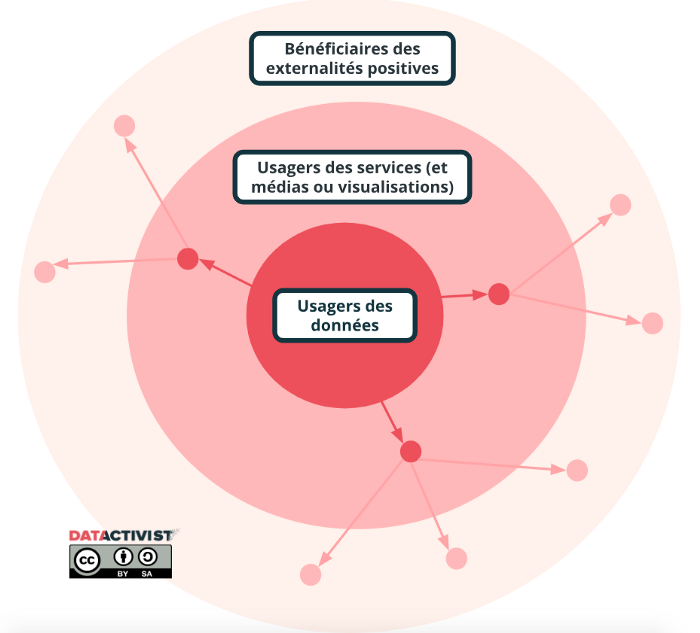

Quand on ouvre un portail open data, ce n’est pas juste pour que des gens téléchargent des données. Alors pourquoi, quand il s’agit d’évaluer l’efficacité d’une démarche open data, on se contente parfois de regarder seulement le nombre de téléchargements, ou le nombre de visites du portail ?

C’est une première étape, mais ce n’est pas suffisant.

Par exemple, l’impact d’un portail open data n’est pas le même s’il alimente quinze applications, sympathiques et locales, mais elles-mêmes utilisées par seulement 600 utilisateurs actifs au total ; ou s’il alimente une seule appli, mais qui elle, concentre 40% des détenteurs de smartphones (sur le territoire et dans le monde).

Si l’objectif d’un portail open data est d’être consulté, c’est encore mieux quand les données sont vraiment utilisées.

Comme l’explique le schéma ci-dessus, la valeur de la donnée se trouve dans l’usage, et ses externalités. Plus on avance dans le cycle de son utilisation, plus son impact potentiel augmente.

Mais alors, comment connaître précisément cet impact de l’utilisation des données ?

C’est là que ça se complique. Car plus on avance dans le degrés d’utilisation des données, plus il est complexe d’évaluer leur usage et leur impact. Le schéma ci-dessous présente cette problématique, en imaginant trois types d’utilisation de données ouvertes (applications et sites web ; études et recherches ; data journalisme, information des citoyens).

Ainsi, pour évaluer au mieux les usages de données, une des solutions peut-être de contacter les utilisateurs (les personnes qui développent les applications, les journalistes qui utilisent le portail…), et leur demander des chiffres d’utilisation / d’audience. Cela n’est pas facile, notamment parce qu’un des principes de l’open data est de donner accès aux données sans qu’une inscription soit nécessaire. Mais on peut par exemple retrouver une partie des réutilisateurs sur twitter, ou lors d’événements spécifiques (accompagner un portail open data d’un compte twitter dédié peut se révéler très utile !).
