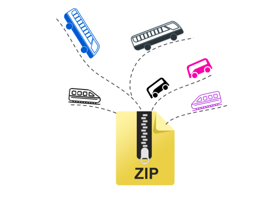
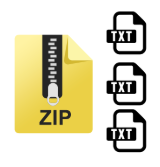

[*Article original posté sur Medium en 2019, dans le cadre d'une mission pour Datactivist*](https://medium.com/datactivist/pourquoi-et-comment-ouvrir-ses-donn%C3%A9es-de-transport-une-m%C3%A9thode-simple-en-3-%C3%A9tapes-d957f5921e57)

Alors que les grandes métropoles voient fleurir depuis plusieurs années des services numériques et des applications autour de leur réseau de transport, les territoires moins denses et les réseaux interurbains sont encore souvent invisibles sur internet.

Pour connaître les horaires des cars régionaux et scolaires, ou ceux des bus d’une petite ville, il est souvent nécessaire de trouver une fiche PDF au fond d’un site institutionnel. Parfois cela convient, d’autres fois, c’est insuffisant : il faut deviner la localisation précise de l’arrêt, et ne surtout pas se tromper sur les indications de calendrier (vacances scolaires). Bref, en 2022, l’idéal voudrait que tout cela soit plus intuitif.

Dans un même temps, l’ouverture des données de transport devient une tendance de fond, et la législation française (la Loi pour une République Numérique, le projet de Loi d’Orientation des Mobilités) ainsi que celle de l’Union Européenne (règlement 2010/40/UE) y sont clairement favorables.

**Mais en quoi publier des données de transport pourrait-il bénéficier aux réseaux moins denses ?**

Premièrement, cela leur permet de développer, ou laisser se développer des solutions numériques (applications, sites internet) qui facilitent les déplacements des usagers ([MaaS — Mobility as a Service](https://en.wikipedia.org/wiki/Mobility_as_a_service)). Ensuite, grâce à une standardisation des données, il devient plus facile et rapide de modifier les horaires et les itinéraires lorsque nécessaire. La publication des données permet aussi de réduire les coûts de diffusion des horaires et des informations sur les lignes.

### Comment faire, par où commencer ?

<blockquote>Nous proposons ici une méthode en trois étapes, qui peut être mise en oeuvre par des personnes ayant un niveau débutant en informatique, et non expertes sur les sujets relatifs aux transports.</blockquote>

<b>En résumé, il s’agit de collecter et organiser des données pour les faire correspondre au standard que l’on appelle le General Transit Feed Specification, puis de faciliter leur intégration dans des applications.
</b>

### Notre cas pratique

Datactivist a accompagné [un projet de standardisation et d’ouverture de données de transports interurbains du Mali](https://forum.ogptoolbox.org/t/presentation-du-projet-data-transport-mali/590), avec lequel nous avons commencé à tester cette méthode. Ce cas illustrera ponctuellement la suite de l’article.

#### 1/ Collecter et organiser les données

**Etat des lieux —** Avant toute chose, une première question est à se poser : *“de quelles données dispose-t-on sur le réseau de transports ?”* Un état des lieux permet d’identifier les atouts et les obstacles avec lesquels on part :

- Format des données : PDF, fichiers Excel, cartographies…
- Etendue des données : horaires, fréquences, calendriers, localisations…
- Propriété et accès aux données : qui y a accès, et qui en est responsable ?

Une fois que l’on a répondu à ces questions, il s’agit de comprendre **de quelles données on aura besoin pour fournir un fichier complet et utilisable.** Dans le cas du format GTFS (détaillé plus tard), il sera nécessaire de rassembler une liste de données spécifiques avant de produire le fichier. Ces données sont, au minimum :

- les arrêts (avec coordonnées géographiques),
- les lignes (points de passages),
- les horaires (fréquences, heures de passages, calendriers…).

**Préparation —** Si les données ne sont pas suffisamment structurées ou précises, une étape intermédiaire consistera à les organiser, soit en réalisant des tableaux simplifiés ([voir nos templates](http://doc.digitaltransport.io/data-transport-mali-GTFS/Etape_2/preparer-lignes-horaires-frequences.html)), lignes par lignes, soit en réalisant des cartographies du réseau, en localisant tous les arrêts et toutes les lignes.

#### 2/ Ecrire les données au standard GTFS

A cette étape, on suppose que les données sur le réseau de transports sont facilement accessibles et répertoriées. La suite consiste à transformer ces données vers le standard GTFS, grâce à un outil libre (il existe d’autres outils de saisie de GTFS mais nous avons délibérément choisi un outil open source): **le Static GTFS Manager.**

**Le GTFS c’est quoi ? —** C’est un format créé à l’origine par Google, devenu le General Transit Feed Specification. Il est aujourd’hui le standard le plus utilisé pour décrire les réseaux de transports en commun dans le monde. 

C’est une base de données relationnelle, qui permet, grâce à des arrêts, des lignes et des trajets à identifiants uniques, de modéliser des itinéraires dans des applications de transports, de gérer le réseau et mettre à jour les horaires, et un grand nombre d’autres usages : voici une [liste d’applications utilisant ce format](https://www.transitwiki.org/TransitWiki/index.php/Category:GTFS-consuming_applications), et [l'introduction au format GTFS](https://github.com/datactivist/datatransportmali/blob/master/Introduction%20au%20GTFS.pdf) réalisée par Datactivist pour en savoir plus.

**En pratique —** Techniquement, il s’agit d’un fichier zip, contenant plusieurs fichiers textes : un ensemble de tableaux avec des informations obligatoires (ex : la localisation des arrêts) et d’autres facultatives (ex : les prix des tickets). Pour construire ces tableaux, on pourrait imaginer pouvoir le faire via un logiciel de tableur classique, mais la saisie serait longue, et sujette à beaucoup d’erreurs. Pour cela, il existe donc des logiciels spécialisés, gratuits ou payants. Notre choix s’est porté sur le [Static GTFS Manager](https://github.com/WRI-Cities/static-GTFS-manager), en open source, et simple d’utilisation.

**Les étapes de A à Z** — Nous avons créé [une documentation](http://doc.digitaltransport.io/data-transport-mali-GTFS/) lors de l’accompagnement du projet Data Transport Mali, qui décrit toutes les étapes pour créer un GTFS à partir de 0, et explique comment saisir progressivement les données dans le logiciel. Le processus est guidé, et il suffit d’avoir préparé les données, et de comprendre le vocabulaire lié au GTFS (s’aider de la [documentation Google](https://developers.google.com/transit/gtfs/reference/?hl=fr) en parallèle).

[Un validateur](https://gtfsfeedvalidator.transitscreen.com/) permet de tester régulièrement le fichier créé, et pointe vers les erreurs et avertissements, ce qui permet d’avancer pas à pas, et d’obtenir à la fin un GTFS exploitable immédiatement.

La méthode décrite dans cette documentation est “minimaliste” : lors du projet Data Transport Mali, il était question de produire un fichier GTFS en une semaine. Les éléments facultatifs ont donc été écartés.

#### 3/ Publier les données et faciliter les usages

Une fois le fichier GTFS finalisé et validé, il reste quelques actions à entreprendre pour que les usagers puissent rechercher facilement des itinéraires en ligne.

Publier le fichier sous licence libre : les réseaux de transports qui publient leur GTFS, le font sous une licence permettant une variété d’usages (y compris commerciaux), et gratuite. Ainsi, la licence ouverte est particulièrement adaptée.

Communiquer sur l’ouverture de ces données : publier un fichier sur un site ne suffit pas pour qu’il soit utilisé. Il convient de le mettre dans les mains des développeurs en contactant les services et applications de transport, en communiquant par exemple sur twitter, et si on est en France, en le répertoriant sur [transport.data.gouv.fr](https://transport.data.gouv.fr/), le point d’accès national pour toutes les données de transport. Pour le projet Data Transport Mali, nous avons sollicité l’application [HereWeGo](https://wego.here.com/?lang=fr-fr), et le calculateur [Navitia](https://www.navitia.io/) en vue d’une intégration des données sur [Transportr](https://transportr.app/).

**Maintenir les données dans le temps** constitue une condition de réussite indispensable. Un flux de données qui renvoie vers des informations périmées (horaires inexacts) freinera rapidement les usages.

<blockquote>Ainsi, il faut prévoir dès l’origine l’actualisation du fichier, ce qui sous-entend une organisation à mettre en place : qui sera en charge d’entrer les nouveaux horaires ? qui corrigera les erreurs ? qui publiera le fichier ? et qui répondra aux usagers ?
</blockquote>

Cette dernière dimension est importante : les services et usagers utilisant les données doivent pouvoir contacter directement le producteur de données (signalements d’erreurs, spécificités du réseau, spécificités du service numérique…).

Pour terminer, il faut retenir que construire un GTFS ne requiert pas de compétences spécifiques en informatique et en transports. Avec de l’organisation, produire un fichier ne demande pas de moyens financiers, mais seulement de saisir une première fois les données de manière méthodique, et de prévoir une gestion dans le temps. **Une fois que le fichier est créé, le plus important est d’aller jusqu’au bout, et faire en sorte qu’une application, ou qu’un site web utilise ces données : c’est là que se remarquera très vite toute la valeur ajoutée de ce travail.**

En savoir plus sur [Datactivist](https://datactivist.coop/fr/)
