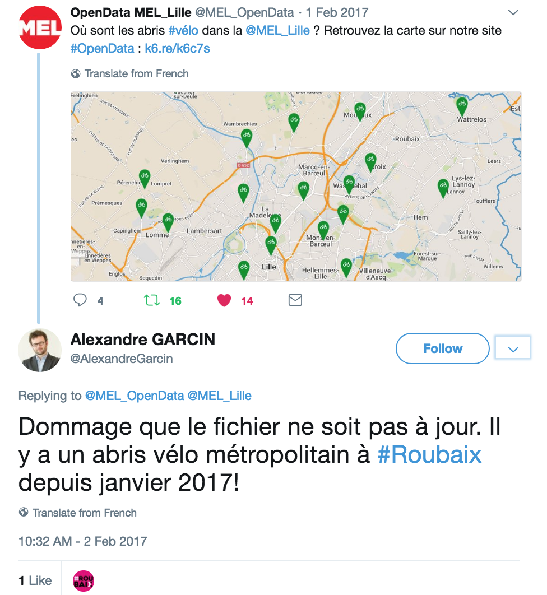
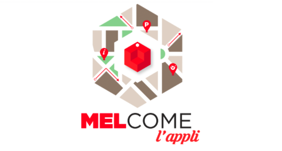

[*Article original posté sur Medium en avril 2018*](https://medium.com/datactivist/les-six-le%C3%A7ons-que-jai-apprises-en-menant-un-projet-open-data-en-collectivit%C3%A9-455362671ab6)

Entre janvier 2016 et avril 2018, j’ai été en charge d’initier et de conduire une politique d’open data pour la Métropole Européenne de Lille.

Voici quelques enseignements que j’ai pu retenir, et découverts au fil de l’eau. Ils n’ont pas vocation à s’appliquer dans tous les contextes, et il est évident qu’il y a autant de façons de mener un projet open data que de collectivités en France et dans le monde : j’expose ici ce qui m’a semblé fonctionner.

---

### 1. Rendre le sujet concret au plus vite, pour éviter de tourner en rond

Que le sujet de l’ouverture des données bénéficie d’un portage politique ou non au sein de l’organisation, qu’une délibération ait été votée ou non, ce qui importera le plus, c’est l’adhésion des agents producteurs de données au principe d’open data.

<blockquote>Les élus ont de bonnes idées, mais les services ont surtout de bonnes données.</blockquote>

Donc la priorité chez nous, a été « d’embarquer » un maximum d’agents dès le début, et nous l’avons vite remarqué, il a fallu pour cela rendre le sujet le plus concret possible. Car tant que l’on ne montre pas à nos interlocuteurs ce qu’est un jeu de données ouvert et un exemple de portail open data, on s’égare dans des considérations, on réinvente la poudre, et au final on tourne en rond. Même après 12 réunions et 5 comités de pilotage.

Le sujet, bien qu’il soit riche, peut être rendu très simple à comprendre lorsque l’on montre à quoi ressemble un portail open data, et que l’on parle de fichiers Excel. Les questions sur les grands programmes du numérique, les spéculations sur les réutilisations, et la réorganisation des systèmes d’information viendront plus tard.

Pour y remédier, outre l’acculturation par l’exemple, une des solutions peut être de lancer un portail open data de test « en interne », pour rassurer, ou plus simple, de publier de premières données sur [data.gouv.fr](https://www.data.gouv.fr/fr/), pour les montrer à tous ceux à qui on parle d’open data.

**Grâce à cela, on peut éviter quelques conversations à tendance paranoïaques, par exemple sur d’éventuels terroristes qui utiliseraient l’open data pour faire disjoncter le territoire.**

Pour parvenir à publier de premières données, voici un second enseignement que j’ai retenu, et qui nous a aidé à avancer plus rapidement que prévu :

### 2. Ouvrir les données que nous avons sous la main

Il est souvent tentant en administration, de proposer un grand plan qui dicte tout et de l’appliquer à tous les services. Nous avons préféré proscrire cette méthode, et travailler d’abord avec ceux qui le voulaient.

Parler à tout le monde, il le faut, mais passer trop de temps avec les services qui ne sont pas prêts et qui n’ont pas encore de culture des données est trop chronophage pour un début — surtout si le souhait est de montrer ce qui marche rapidement (enseignement précédent).

Donc l’idée est ici de trouver des « alliés », qui dans l’administration, vont commencer à travailler sur l’ouverture de leurs données, véhiculeront les messages positifs sur le sujet, et montreront de premières réalisations. Nous irons chercher les autres services par la suite.

À la MEL, c’est par exemple la direction des Systèmes d’Information Géographique, qui était déjà très avancée sur le sujet. C’est souvent les cas dans les collectivités, grâce notamment à la directive INSPIRE, et de par les métiers relatifs aux SIG, déjà orientés vers la gestion et le partage des données.

<blockquote>Dans toute collectivité, on peut trouver un « moteur » pour initier la démarche : un service communication « branché », un.e « geek » dans un service informatique, un.e élu.e inspirant.e… Il suffit juste de le trouver, et de lancer la boule de neige.</blockquote>

### 3. Viser une qualité maximale des données n’empêche pas le droit à l’erreur

Cela va de soi, les administrations doivent faire de leur mieux pour ouvrir des données de qualité.

Il faut être intransigeant sur le respect des lois en vigueur (données personnelles, CNIL, RGPD, secret défense, secret industriel et commercial, etc…), au risque, à minima, de « planter » la démarche open data en un seul clic — bien qu’en général, ces précautions sont très (si ce n’est pas trop) anticipées dans les services producteurs de données. -

Ce qui est moins évident, et qui peut être sujet à discussion, c’est de s’accorder un certain droit à l’erreur, ou du moins, un droit à des erreurs acceptables. Il nous est arrivé plusieurs fois, nous le verrons par la suite, de publier un jeu de données comportant des erreurs de localisations ; de lancer une idée qui n’a pas marchée : Data.e ; ou de publier des jeux de données qui n’ont jamais donné de réutilisations ou d’interprétations (à notre connaissance) : [Crémations](https://opendata.lillemetropole.fr/explore/dataset/cremations-depuis-2014/table/?flg=fr&location=3,35.37295,-26.10849&basemap=jawg.streets).

Mais tous ces imprévus, et il y en a eu d’autres, n’ont pas eu de graves conséquences, **au contraire, ils nous ont aidé à améliorer notre démarche, en l’adaptant sur le moment. Et même : les erreurs ont été pointées par les réutilisateurs et nous les avons corrigées.**

C’est l’objet de l’enseignement suivant :

### 4. Ouvrir ses données, sans ouvrir son administration « tout court », c’est impossible

Une fois les doutes et les appréhensions passés, et le portail ouvert, nous avons très vite compris que nous n’ouvrions pas seulement nos données mais notre administration dans son ensemble.

<blockquote>Ouvrir ses données, c’est l’opportunité de créer une interface nouvelle entre les métiers techniques et le territoire. Si les données sont ouvertes mais que le citoyen n’a aucun moyen de contacter le producteur de données alors qu’il repère des erreurs par exemple, la démarche est inachevée.</blockquote>

Deux mois après l’ouverture du portail, nous avons lancé [un compte twitter dédié à notre open data](https://twitter.com/MEL_OpenData). D’autres organisations avaient déjà fait ce choix et nous avions l’intuition que c’était une bonne idée.

Là encore, il y a eu un temps de doutes, et il a fallu trouver les bons arguments pour ouvrir ce compte. Va-t-on recevoir des critiques, ou trop nous exposer ?

Au début, nous envisagions ce canal comme un moyen de donner de l’audience à nos données, et cela a été efficace. Mais la véritable plus-value a été dans la réactivité du réseau concernant nos données.

Car avec twitter, de manière pragmatique , on ne touche pas ce que l’on appelle le « grand public ». Une bonne partie des utilisateurs de ce réseau social est souvent bien acculturée aux sujets numériques et comprennent souvent les données. Et c’est ce qui en fait aussi la force : à la moindre erreur dans notre open data, nous étions mentionnés, sollicités, contactés. Nous avons ainsi amélioré quelques unes de nos données directement grâce aux utilisateurs.

En plus de cela, nous l’avons toujours constaté, ces remarques sur nos données ont souvent été faites de manière bienveillante : de simples constats, des pointages d’erreurs, des suggestions. Jamais de propos insultants ou malveillants, qui auraient pu freiner très vite nos efforts d’ouvertures.

Et c’est grâce à cette réactivité, qu’à chaque jeux de données publiés sur le site, nous sommes ainsi allés chercher cette « exposition » sur le réseau social, ce que nous n’aurions peut être pas fait avant de nous jeter à l’eau.

### 5. Utiliser soi-même les données que l’on ouvre : la base !

Un principe important que nous avons compris en ouvrant nos données est celui que l’on nomme en anglais [*« eat your own dog food »*](https://fr.wikipedia.org/wiki/Dogfooding) — qui consiste (pour l’open data) à utiliser en interne les données que l’on ouvre au grand public. Cela peut paraître logique, mais le meilleur moyen de se rendre compte que ses données comportent des erreurs ou sont mal structurées, c’est de les utiliser soi même.

C’est pour cela que l’application MELcome, produite par les services, s’alimente uniquement sur les données de l’open data. A défaut de proposer des services différents de ceux qui existaient déjà par ailleurs, ce projet d’application aura permis d’ouvrir de nouvelles données, de les enrichir et d’améliorer leur qualité.

Autre exemple : Google Transit, en intégrant nos données sur les transports (horaires, lignes), nous a proposé de tester l’application pour la région lilloise en mode beta.

**En l’utilisant au quotidien pour nous guider dans les transports, nous avons pu repérer quelques erreurs dans les données, et les faire corriger par l’exploitant.**

### 6. Profiter des opportunités qui se présentent pour ouvrir la démarche

Nous nous sommes appliqués une règle : dire oui à (presque) toutes les propositions de projets, en interne comme en externe. Ainsi, nous avons participé à des challenges, des évènements sur nos données, avec des étudiants, des associations, des entreprises, qui ont pu connaitre la démarche et orienter l’ouverture de nos données grâce à leurs retours.

Des étudiant.e.s de Sciences Po Lille ont redesigné notre politique d’open data, des chercheurs du CNRS ont créé un prototype de réalité virtuelle à partir de nos données, et nous avons souhaité profiter de l’accès aux données de Waze (via notre open data sur les travaux) pour les archiver et les analyser…

<blockquote>Si l’on souhaite que l’open data soit utile, cette posture ouverte de la part des services permet aussi d’être à l’écoute de l’écosystème, de comprendre concrètement quelles sont les données les plus demandées, et de les ouvrir en conséquence.</blockquote> 

Et donc j’aurais tendance à conseiller de passer le plus de temps possible en dehors des bureaux, pour aller chercher un maximum de demandes de données ouvertes, et d’avis sur celles qui le sont déjà.

---

Pour terminer, et suite à ces quelques enseignements qui ont fonctionné pour Lille, je ne peux qu’inciter toute collectivité qui se lance dans l’open data à avancer comme elle l’entend, et comme elle le peut. L’ouverture des données peut se révéler peu couteuse, apporter beaucoup à la collectivité, tout en prenant peu de temps aux services : il suffit de partir motivés, de s’organiser de manière efficace et réorienter sa démarche lorsque nécessaire, et d’être ouvert à toutes les pistes.

**Donc première étape : trouvez vos alliés !**

---
*Je remercie Thomas Vincent et Jérôme Van Oost, grâce à qui le projet a pu avancer sans contraintes dans la métropole lilloise.*
